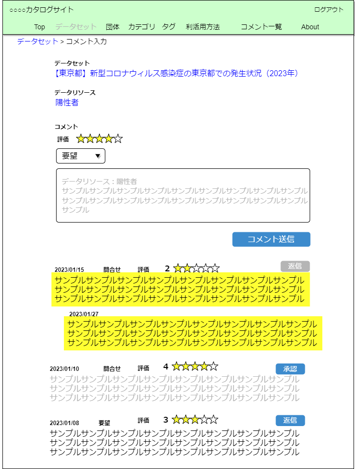
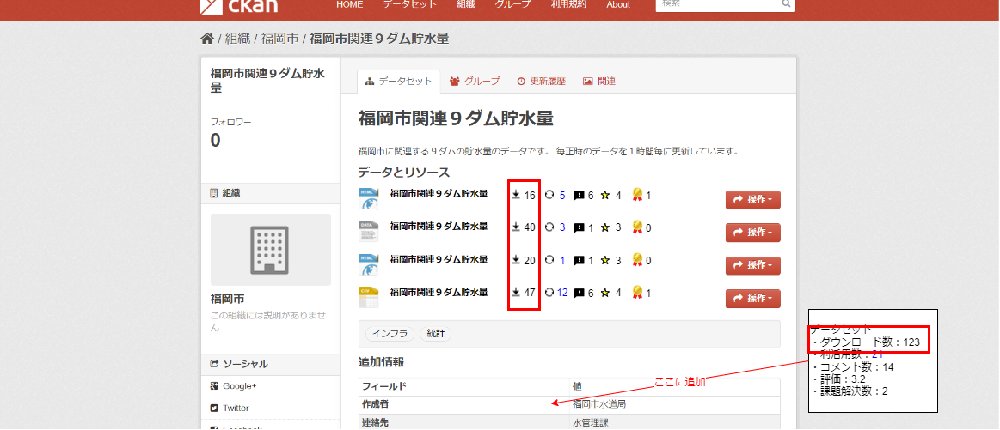

# ckanext-feedback

このCKAN Extensionは大きく3つのモジュールを提供します。

* データの利活用方法に関するモジュール
* リソースへのレビューに関するモジュール
* ダウンロードに関するモジュール

## 現状の課題

### オープンデータ公開元(自治体など)

* オープンデータの活用状況がわからない
  * 公開したオープンデータの重要性がわからない
  * 公開済みのオープンデータをどのように整備したら良いかわからない

### 利用者(シビックハッカーなど)

* オープンデータ活用へのハードルが高い
  * オープンデータに対する質問や問い合わせに時間と労力がかかる

このような課題を解決するための機能を提供するCkan Extensionです。

## 提供する機能

### データの利活用に関するモジュール

#### 機能

* 利活用方法をオープンデータに紐付けて登録する
* 登録された利活用方法に対してコメントする( 要望 / 質問 / 宣伝 / 感謝 )


#### 利点

* データ公開者
    * どのような要望があるかわかる
    * 利活用方法を知ることでオープンデータの重要性を確認できる
    * 需要のあるオープンデータが分かり、今後のオープンデータ公開に関する計画が立てやすくなる

* データ利用者
    * データを活用して開発したものを登録できる
    * 開発物へのフィードバックを得ることができる

### データへのレビューに関するモジュール

#### 機能

* 公開しているオープンデータを評価
* オープンデータに対してコメントする( 要望 / 質問 / 宣伝 / 感謝 )



#### 利点

* データ公開者
    * 公開済みのデータをどのような優先度でどのように整備したら良いかわかる

* データ利用者
    * 問い合わせをすぐに楽に行える
    * 評価の高い(信頼できる)オープンデータをすぐに見つけ、利活用できる

### ダウンロードに関するモジュール

#### 機能

* 公開しているオープンデータのダウンロード数を表示



#### 利点

* データ公開者
    * オープンデータの利用状況や需要がわかる

* データ利用者
    * よく利用されているデータを知ることができる

## インストール

### クイックスタート

1. CKANの仮想環境をアクティブにする
   ```
   . /usr/lib/ckan/venv/bin/activate
   ```

2. 仮想環境にckanext-feedbackをインストールする
   ```
   pip install ckanext-feedback
   ```

3. CKAN config fileの`ckan.plugins`に`feedback`を追加する
   `vim /etc/ckan/production.ini` 以下の行に`feedback`を追加
   ```
   ckan.plugins = stats ・・・ recline_view feedback
   ```

4. フィードバック機能に必要なテーブルを作成する  
   ```
   ckan *config=/etc/ckan/production.ini feedback init
   ```

### オンオフ機能

* ckanext-feedbackには以下の3つのモジュールがあり、それぞれのモジュールのオンオフを切り替えることが出来ます。
  * utilization(データの利活用方法に関するモジュール)
  * resource(リソースへのレビューに関するモジュール)
  * download(ダウンロードに関するモジュール)  
※ デフォルトでは全てのモジュールがオンになっています

#### 設定手順

1. CKANの仮想環境をアクティブにする
   ```
   . /usr/lib/ckan/venv/bin/activate
   ```

2. 仮想環境にckanext-feedbackをインストールする
   ```
   pip install ckanext-feedback
   ```

3. CKAN config fileの`ckan.plugins`に`feedback`を追加する  
   `vim /etc/ckan/production.ini` 以下の行に`feedback`を追加
   ```
   ckan.plugins = stats ・・・ recline_view feedback
   ```

   オフにしたい機能がある場合は`ckan.plugins`の下に以下の記述を追記する

    * utilizationモジュールをオフにする  
    ```
    ckan.feedback.utilizations.enable = False
    ```

    * resourceモジュールをオフにする  
    ```
    ckan.feedback.resources.enable = False
    ```

    * downloadモジュールをオフにする  
    ```
    ckan.feedback.downloads.enable = False
    ```

4. それぞれのモジュールに必要なテーブルを作成する(コマンドのオプションで作成するテーブルを指定する)

    * utilizationモジュールを利用する場合
    ```
    ckan config=/etc/ckan/production.ini feedback init -m utilization
    ```

    * resourceモジュールを利用する場合
    ```
    ckan config=/etc/ckan/production.ini feedback init -m resource
    ```

    * downloadモジュールを利用する場合
    ```
    ckan config=/etc/ckan/production.ini feedback init -m download
    ```

## ビルド方法

1. `ckanext-feedback`をローカル環境にGitHub上からクローンする
    ```
    git clone https://github.com/c-3lab/ckanext-feedback.git
    ```

2. `/development/setup.sh`を実行し、コンテナを起動

3. CKAN公式の手順に従い、以下のコマンドを実行
    ```
    docker exec ckan /usr/local/bin/ckan -c /etc/ckan/production.ini datastore set-permissions | docker exec -i db psql -U ckan
    ```
    ```
    docker exec -it ckan /usr/local/bin/ckan -c /etc/ckan/production.ini sysadmin add admin
    ```

4. 以下のコマンドを実行し、ckanコンテナ内に入る
    ```
    docker exec -it ckan bash
    ```

5. CKANの仮想環境をアクティブにする
   ```
   . /usr/lib/ckan/venv/bin/activate
   ```

6. 仮想環境にckanext-feedbackをインストールする
   ```
   pip install ckanext-feedback
   ```

7. CKAN config fileの`ckan.plugins`に`feedback`を追加する
   `vim /etc/ckan/production.ini` 以下の行に`feedback`を追加
   ```
   ckan.plugins = stats ・・・ recline_view feedback
   ```

8. フィードバック機能に必要なテーブルを作成する  
   ```
   ckan *config=/etc/ckan/production.ini feedback init
   ```

## LICENSE

[AGPLv3 LICENSE](https://github.com/c-3lab/ckanext-feedback/blob/feature/documentation-README/LICENSE)

## CopyRight

Copyright (c) 2023 C3Lab