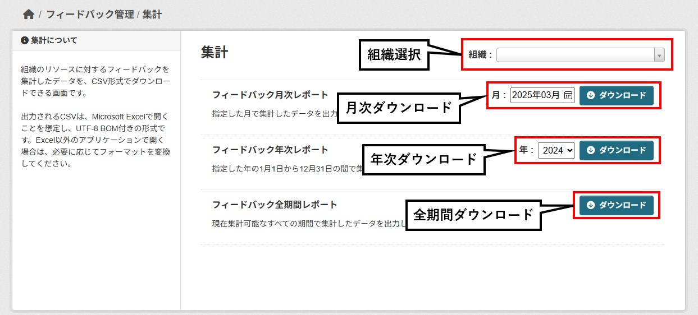

# Administrator Dashboard

This document explains the administrator dashboard for **ckanext-feedback**.

## Feedback Management Dashboard
Provides administrative functions related to feedback. You can access various screens for feedback management.

### Management Functions
- [Approval & Deletion](#approval--deletion-screen)
- [Aggregation](#aggregation-screen)

## Approval & Deletion Screen
This is an administrative screen where you can approve or delete resource comments, utilization registration applications, and utilization comments for your organization's resources.

### Filtering
You can filter displayed items by the following criteria:
- **Status**
  - **Approved**: Display approved items.
  - **Unapproved**: Display unapproved items.
- **Type**
  - **Resource Comments**: Display resource comment items.
  - **Utilization**: Display utilization items.
  - **Utilization Comments**: Display utilization comment items.
- **Organization**
  - **ORG A**: Display items from Organization A.
  - **ORG B**: Display items from Organization B.

  ※ Only organizations manageable by the currently logged-in account are displayed.

### Sorting
You can change the list order by the following criteria:
- Newest first
- Oldest first
- Dataset name (ascending)
- Dataset name (descending)
- Resource name (ascending)
- Resource name (descending)

### Select All / Deselect All
You can select or deselect all items in the list at once.

### Approve & Delete Buttons
You can approve or delete selected items.

**※ Once deleted, items cannot be restored.**

## Aggregation Screen
This screen allows you to download aggregated feedback data for your organization's resources in CSV format.

### Organization Selection
You can select an organization managed by the currently logged-in user.  
If there is only one organization, it will be pre-selected when the screen loads.  
If there are multiple organizations, no organization will be pre-selected when the screen loads.

### Download Reports
There are three types of feedback aggregation data available, and you can download them by specifying a period.  
※ Reports cannot be downloaded if no organization is selected.
- Monthly Feedback Report  
  Outputs data aggregated for the specified month.  
  File name: Monthly_Feedback_Report_yyyymm.csv
- Annual Feedback Report  
  Outputs data aggregated from January 1st to December 31st of the specified year.  
  File name: Annual_Feedback_Report_yyyy.csv
- All-Period Feedback Report  
  Outputs data aggregated for all currently available periods.  
  File name: All_Period_Feedback_Report.csv

### Report Content
The content of the output reports is as follows:  
| No. | Item | Description |
| :-: | :- | :- |
| 1 | Resource ID | ID associated with the resource. |
| 2 | Organization Name | Organization title. |
| 3 | Dataset Name | Dataset title. |
| 4 | Resource Name | Resource title. |
| 5 | Downloads | Number of times downloaded. |
| 6 | Comments | Number of comments. |
| 7 | Utilizations | Number of utilization registrations. |
| 8 | Utilization Comments | Number of utilization comments. |
| 9 | Issue Resolutions | Number of issue resolutions. |
| 10 | Likes | Number of likes. |
| 11 | Average Rating | Average rating score. |
| 12 | Link | URL to the resource page. |

### CSV File Format
The output CSV is in UTF-8 with BOM format, intended to be opened with Microsoft Excel.  
If you open it with other applications, please convert the format as needed.  