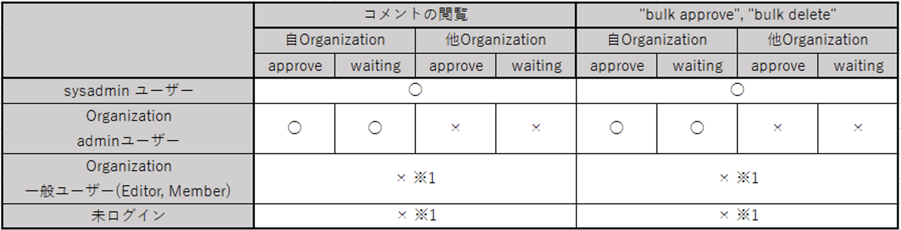
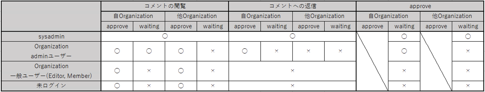
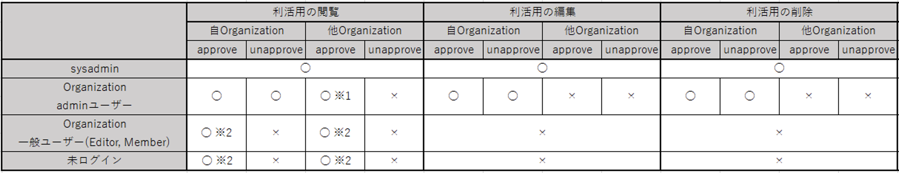
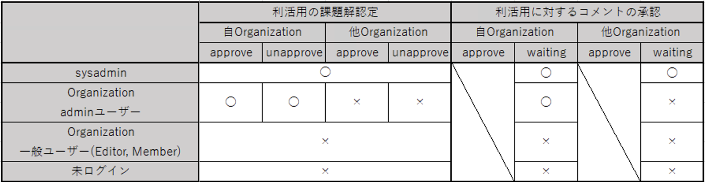

# Administrator Permissions

* Permissions are configured for the following four types of users:
  * sysadmin user
    * User with administrator privileges for the entire CKAN system
  * Organization admin user
    * User with administrator privileges for a specific configured Organization
  * Organization general user (Editor, Member)
    * General user who can only edit Datasets and Resources registered in a specific Organization
  * Non-logged-in user
    * User who is not logged in

* Permissions are granted according to the following matrix diagrams
  * Vertical axis: Represents whether the user is logged in and the type of logged-in user
  * Horizontal axis:
    * (Row 1): Represents the actions (approve, edit, etc.) that can be performed on each screen
    * (Row 2): Represents whether a Resource belongs to the user's own Organization or another Organization from the perspective of a user belonging to an Organization
    * (Row 3): Represents whether comments or utilization methods are in an Approved state or in a Waiting state before approval
      * (Example 1): In the comment management screen, Organization admin users can view comments registered in their own Organization regardless of Approve/Waiting status (marked with ◯)
      * (Example 2): In the comment management screen, Organization admin users cannot view comments registered in other Organizations regardless of Approve/Waiting status (marked with ×)

* Matrix diagram summarizing permissions for actions within the comment management screen

  ※1 The tab to navigate to the comment management screen is not displayed in the page header, and navigation to the screen is not possible even when specifying the URL (/management/comments)

* Matrix diagram summarizing permissions for actions within the Resource comment screen

* Matrix diagram summarizing permissions for actions within the Utilization screen (View, Edit, Delete)

  ※1 Status column is displayed but remains blank  
  ※2 Status column is not displayed

* Matrix diagram summarizing permissions for actions within the Utilization screen (Certify, Approve)

