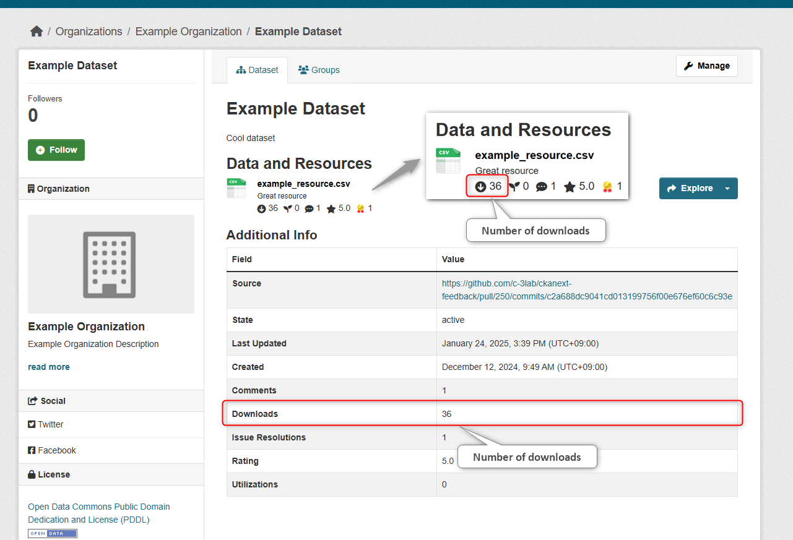

# download Module

This module aggregates and visualizes the number of downloads.

## Benefits of Implementation

* You can understand the usage status of the data
  * It can serve as a guideline when planning data publication and maintenance
  * It helps to recognize the importance of open data

## Function Description

【download Module Image】  

* You can aggregate the number of downloads for each data resource

* You can visualize the following two types of aggregated information
  * Number of downloads for each data resource
  * Total number of downloads for each resource within a package

## Options

### Integration with External Plugins

You can call functions of other extensions as a callback after the download count processing is performed.
