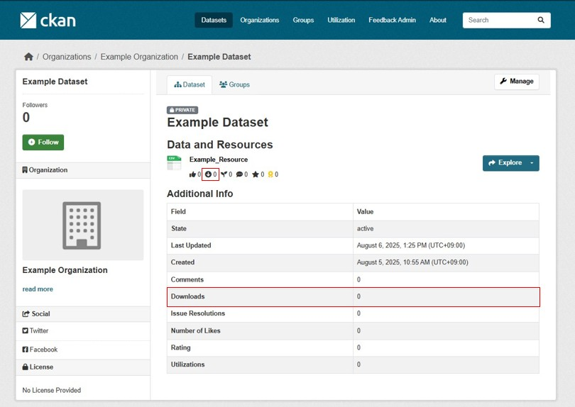
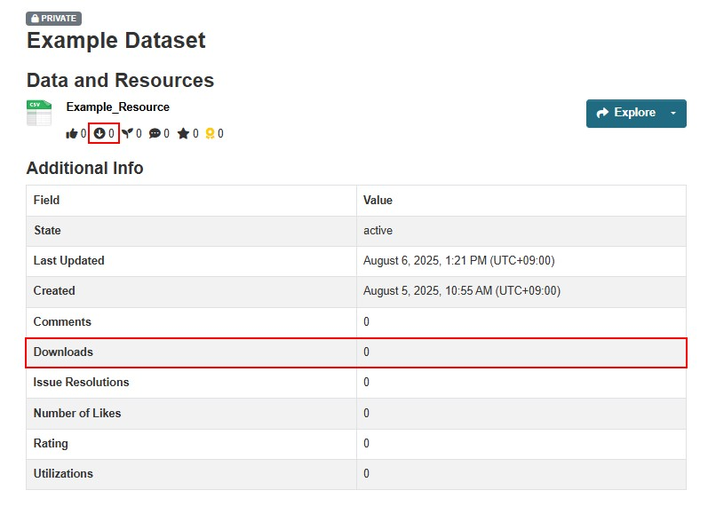

# Download Module

A module that aggregates and visualizes the number of downloads.

## Overview

### Benefits of Implementation

* You can understand how data is being utilized.
  * Provides guidelines for planning data publication and maintenance.
  * Helps recognize the importance of open data more clearly.

## Key Features

* You can aggregate the number of downloads for each data resource.

* You can visualize the following two types of aggregated information:
  * Number of downloads for each data resource
  * Total number of downloads for all resources within a package

## Optional Features

### Feedback Prompt (Modal Window)
A modal window requesting feedback is displayed when the download button is pressed.

### Feature Description

#### 1. Like Button (Like Module)
The state of the like button is synchronized with the like button on the download screen and modal window.

For detailed features of the Like module, please refer to the following document:

[Detailed Documentation for Like Module](./likes.md)

#### 2. Utilization Registration Button (Utilization Module)

Pressing the utilization registration button opens the utilization registration screen in a new tab.

For detailed features of the Utilization module, please refer to the following document:

[Detailed Documentation for Utilization Module](./utilization.md)

#### 3. Comment Button (Resource Module)

Pressing the comment button opens the resource comment registration screen in a new tab.

For detailed features of the Resource module, please refer to the following document:

[Detailed Documentation for Resource Module](./resource.md)

## Configuration
**Only modules that are turned ON will be displayed in the modal window.**

(Example): When only the Like module is OFF, only the utilization registration button and comment button are displayed

For configuration instructions, please refer to the following document:  
[Detailed Documentation on ON/OFF Features](./switch_function.md)

