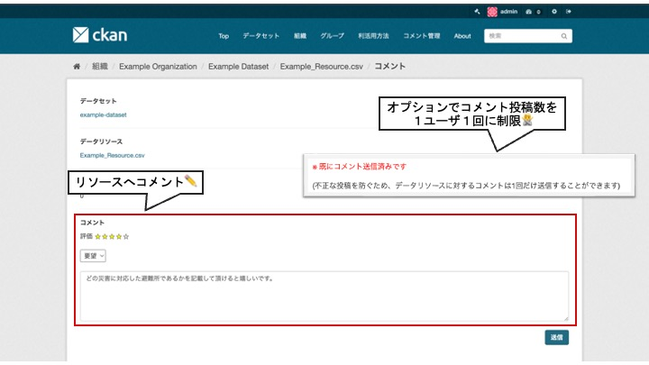

# resource Module

This module allows you to comment and rate data resources.

## Benefits of Implementation

* Understand the utilization status of data
  * Serve as a guideline when planning data publication and maintenance
  * Increase awareness of the importance of open data

* Easily inquire about data
  * Enhance understanding and utilization of data

## Function Description

【resource Module Comment Registration Screen Image】  

【resource Module Dataset Detail Screen Image】  
  

* You can do the following for each data resource:
  * Comment on each data resource
  * Rate each data resource

* Visualize the following two aggregated information:
  * Display ratings for data resources with 5 stars
  * Display the number of comments on data resources

## Options

You can limit the number of comments per user to one per resource (using user cookie information).  
※ To prevent fraudulent posts  

Please refer to the following document for the configuration method.  
[on/off Function Detailed Document](./switch_function.md)
