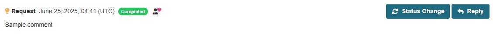
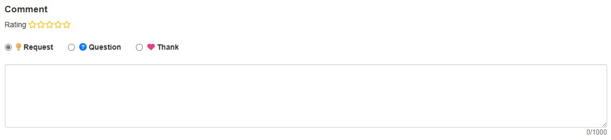

# Resource Module

A module that allows commenting and rating on data resources.


## Overview

### Benefits of Implementation

* **Understanding Data Utilization Status**
  * Provides guidelines for planning data publication and maintenance
  * Helps recognize the importance of open data more clearly

* **Simplifying Data Inquiries**
  * Promotes understanding of data and encourages utilization

## Key Features

### 1. Comment Feature

You can do the following for data resources:
* Submit comments on data resources
* **Image Attachment Feature** (optional)


### 2. Visualization of Aggregated Information

The following information can be visualized:
* Number of comments on data resources


### 3. Response Status Management by Administrators

* Management of response status for resource comments
* Visualization of response status
  * Unaddressed
  * In Progress
  * Completed
  * Deferred
* Administrator high-rating feature



## Optional Features

### Repeat Post Limit

You can limit each user to commenting only once per resource.

* **Use Case**: Spam prevention
* **Technology**: Cookie-based


### Rating

You can express ratings for each data resource using a 5-star system.



### Image Attachment

Enables attaching images to comments and replies.


### Reply Open

Allows non-administrators to reply to comments as well.


#### Configuration

If you want to specify a directory for storing images, add the following configuration to `ckan.ini`:

```ini
ckan.feedback.storage_path = /path/to/storage
```

**Notes**:
* Please replace the above path `/path/to/storage` appropriately for your environment
* If this configuration is not specified, the `/var/lib/ckan/feedback` directory will be used as the default storage location

## Configuration

For ON/OFF settings of each feature, please refer to the following document:

📖 [Detailed Documentation on ON/OFF Features](./switch_function.md)

