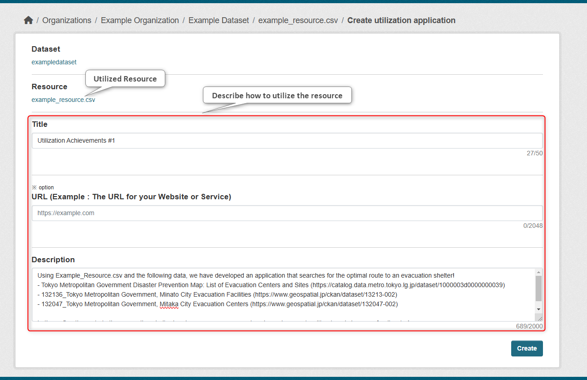
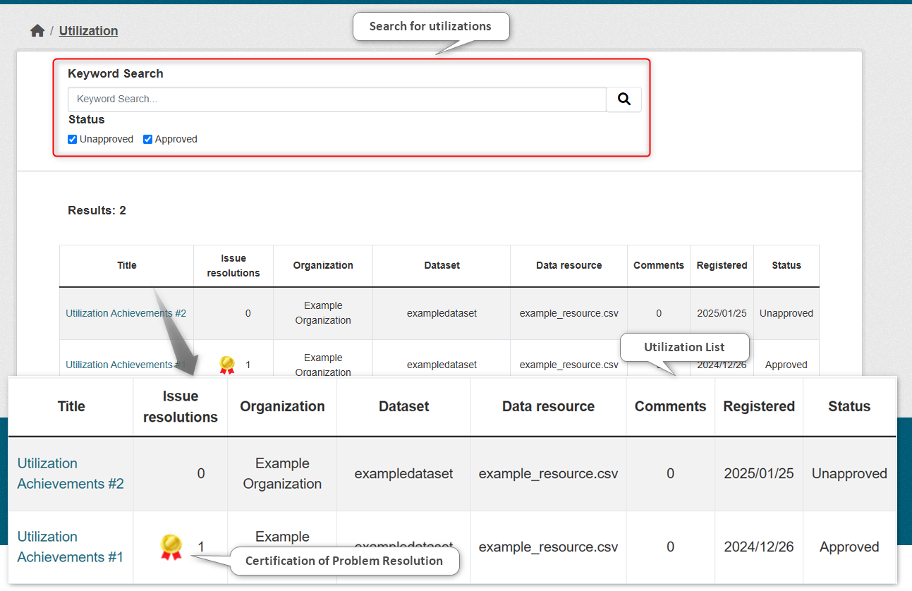
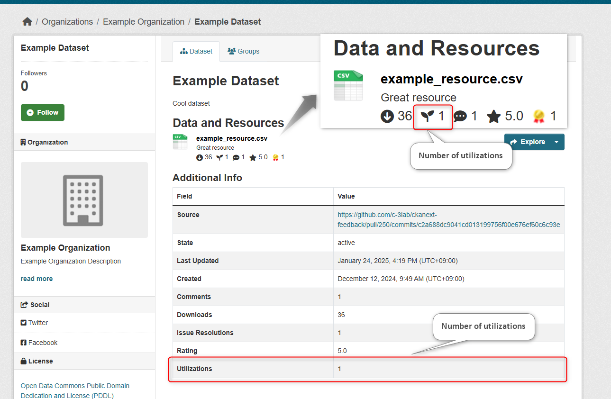
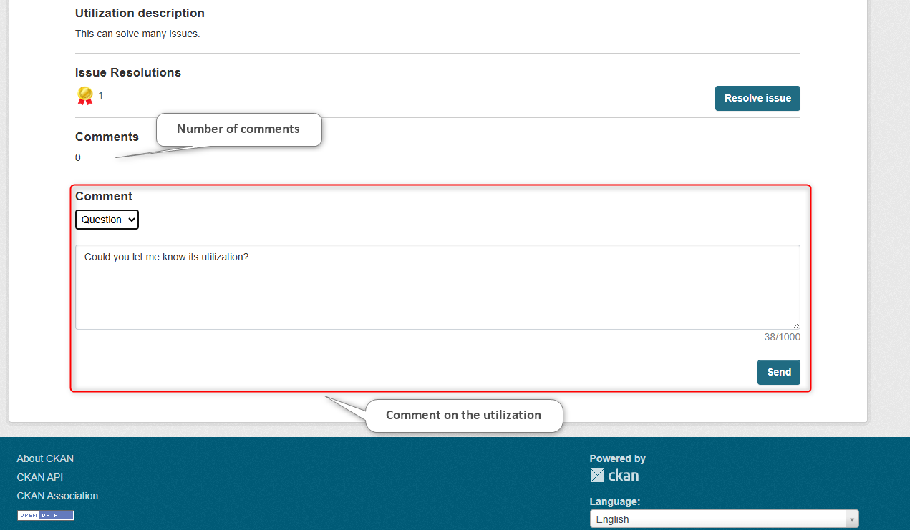

# Utilization Module

This module allows you to register utilization methods linked to data.  
You can also send comments to the registered utilization methods.

## Benefits of Introduction

* You can understand the utilization status of the data
  * It serves as a guideline when planning data publication and maintenance
  * It helps to recognize the importance of open data more

* The use and improvement of utilization methods using data will progress

## Function Description

【Utilization Module Registration Screen Image】  

【Utilization Module Utilization Method Search Screen Image】  

【Utilization Module Utilization Method Detail Screen Image】  

【Utilization Module Resource Detail Screen Image】  

* You can do the following for apps and systems that utilize data
  * Introduction of utilization methods
  * Certification of problem-solving
  * Comments on utilization methods

* You can visualize the following three aggregated information
  * Number of utilizations per data resource
  * Number of problem-solving utilizations
  * Number of comments on utilization methods

