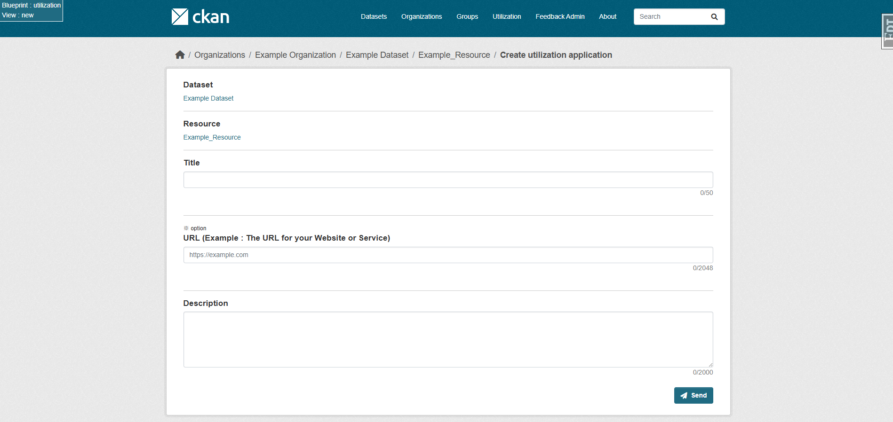
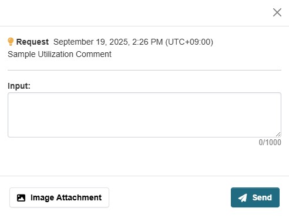

# Utilization Module

A module that allows registering utilization methods associated with data.  
You can also send comments to registered utilization methods.
## Overview

### Benefits of Implementation

* **Understanding Data Utilization Status**
  * Provides guidelines for planning data publication and maintenance
  * Helps recognize the importance of open data more clearly

* Progress in utilization and improvement of data utilization methods
  
* The following three aggregated information items can be visualized:
  * Number of utilizations per data resource
  * Number of issue resolutions in utilization
  * Number of comments on utilization methods

## Key Features
  ### 1. Registration of Utilization Methods
  You can do the following for data resources:
 * Register utilization methods for data resources
   
 

  ### 2. Search for Utilization Methods
  

   
  
  ### 3. Comments on Utilization Methods
  
 

 ## Optional Features

 ### Image Attachment

Enables attaching images to comments and replies.

  

 

### Reply Open

Allows non-administrators to reply to comments as well.

#### Configuration

For ON/OFF settings of each feature, please refer to the following document:

📖 [Detailed Documentation on ON/OFF Features](./switch_function.md)

