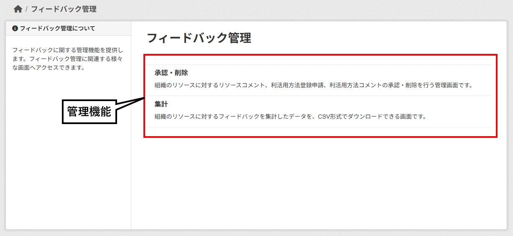

# 管理者画面

本ドキュメントでは、**ckanext-feedback**の管理者画面について説明します。

## フィードバック管理画面
フィードバックに関する管理機能を提供します。フィードバック管理に関連する様々な画面へアクセスできます。

### 管理機能
- [承認・削除](#承認・削除画面)

## 承認・削除画面
組織のリソースに対するリソースコメント、利活用方法登録申請、利活用方法コメントの承認・削除を行う管理画面です。

### 絞り込み
表示する項目を以下の条件で絞り込めます。
- **ステータス**
  - **承認済**：承認済の項目を表示します。
  - **承認待ち**：承認のされていない項目を表示します。
- **種類**
  - **リソースコメント**：リソースコメントの項目を表示します。
  - **利活用方法**：利活用方法の項目を表示します。
  - **利活用コメント**：利活用コメントの項目を表示します。
- **組織**
  - **ORG A**：組織Ａの項目を表示します。
  - **ORG B**：組織Ｂの項目を表示します。

  ※ ログイン中のアカウントで管理可能な組織が表示されます。

### 並び替え
リストの並び順を以下の条件で変更できます。
- 新着順
- 古い順
- データセット名 昇順
- データセット名 降順
- リソース名 昇順
- リソース名 降順

### 全選択・解除
一覧の項目を一括で選択・解除できます。

### 承認・削除ボタン
選択した項目を承認または削除できます。

**※ 削除を行った場合、元に戻すことはできません。**