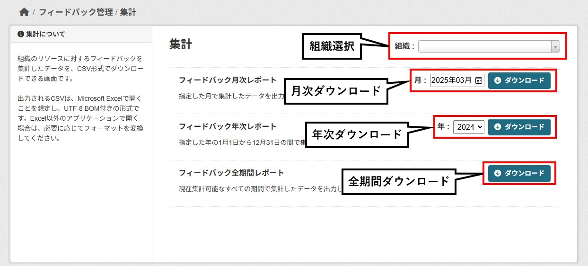

# 管理者画面

本ドキュメントでは、**ckanext-feedback**の管理者画面について説明します。

## フィードバック管理画面
フィードバックに関する管理機能を提供します。フィードバック管理に関連する様々な画面へアクセスできます。

### 管理機能
- [承認・削除](#承認・削除画面)
- [集計](#集計画面)

## 承認・削除画面
組織のリソースに対するリソースコメント、利活用方法登録申請、利活用方法コメントの承認・削除を行う管理画面です。

### 絞り込み
表示する項目を以下の条件で絞り込めます。
- **ステータス**
  - **承認済**：承認済の項目を表示します。
  - **承認待ち**：承認のされていない項目を表示します。
- **種類**
  - **リソースコメント**：リソースコメントの項目を表示します。
  - **利活用方法**：利活用方法の項目を表示します。
  - **利活用コメント**：利活用コメントの項目を表示します。
- **組織**
  - **ORG A**：組織Ａの項目を表示します。
  - **ORG B**：組織Ｂの項目を表示します。

  ※ ログイン中のアカウントで管理可能な組織が表示されます。

### 並び替え
リストの並び順を以下の条件で変更できます。
- 新着順
- 古い順
- データセット名 昇順
- データセット名 降順
- リソース名 昇順
- リソース名 降順

### 全選択・解除
一覧の項目を一括で選択・解除できます。

### 承認・削除ボタン
選択した項目を承認または削除できます。

**※ 削除を行った場合、元に戻すことはできません。**

## 集計画面
組織のリソースに対するフィードバックを集計したデータを、CSV形式でダウンロードできる画面です。

### 組織選択
ログイン中のユーザーで管理している組織を選択することが可能です。  
組織が１つの場合は、画面遷移時すでに組織が選択されています。  
組織が複数ある場合は、画面遷移時には組織が選択されていません。

### レポートをダウンロード
3種類のフィードバックの集計データがあり、期間を指定してダウンロードができます。  
※ 組織を選択していない場合は、レポートをダウンロードすることが出来ません。
- フィードバック月次レポート  
  指定した月で集計したデータを出力します。  
  ファイル名：フィードバック月次レポート_yyyymm.csv
- フィードバック年次レポート  
  指定した年の1月1日から12月31日の間で集計したデータを出力します。  
  ファイル名：フィードバック年次レポート_yyyy.csv
- フィードバック全期間レポート  
  現在集計可能なすべての期間で集計したデータを出力します。  
  ファイル名：フィードバック全期間レポート.csv

### レポート内容
出力されるレポートの内容は以下の通りです。  
| No. | 項目 | 説明 |
| :-: | :- | :- |
| 1 | リソースID | リソースに紐づくID。 |
| 2 | 組織名 | 組織タイトル。 |
| 3 | データセット名 | データセットタイトル。 |
| 4 | リソース名 | リソースタイトル。 |
| 5 | ダウンロード数 | ダウンロードされた回数。 |
| 6 | コメント数 | コメントされた回数。 |
| 7 | 利活用数 | 利活用登録された回数。 |
| 8 | 利活用コメント数 | 利活用コメントされた回数。 |
| 9 | 課題解決数 | 課題解決された回数。 |
| 10 | いいね数 | いいねされた回数。 |
| 11 | 平均評価数 | レイティングの平均。 |
| 12 | リンク | リソース画面のURL。 |

### CSVファイルの形式
出力されるCSVは、Microsoft Excelで開くことを想定し、UTF-8 BOM付きの形式です。  
Excel以外のアプリケーションで開く場合は、必要に応じてフォーマットを変換してください。  
