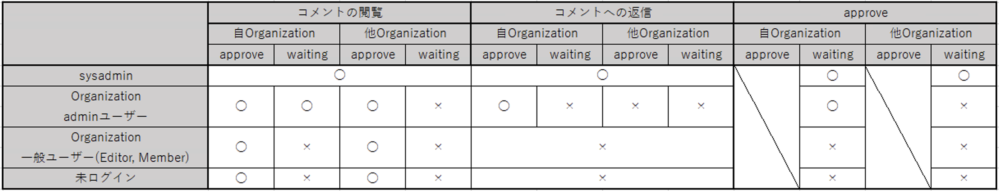
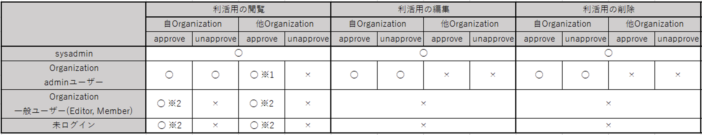

# 管理者権限

* 以下の4つのユーザーによって、権限を設定しています。
  * sysadmin ユーザー
    * CKAN全体の管理者権限を持つユーザー
  * Organization admin ユーザー
    * 設定されている特定のOrganizationで管理者権限を持つユーザー
  * Organization 一般ユーザー(Editor, Member)
    * 特定のOrganizationに登録されているDataset, Resourceの編集のみ可能な一般ユーザー
  * 未ログインユーザー
    * ログインしていないユーザー

* 以下のマトリクス図に則って権限を付与しています
  * 縦軸：ログインの有無、ログインしているユーザーの種別を表現しています
  * 横軸：
    * (1行目)：それぞれの画面で実行可能なアクション(承認・編集 など)を表現しています
    * (2行目)：Organizationに所属しているユーザーから見たときに、Resourceが自身のOrganizationに登録されているか、他のOrganizationに登録されているかを表現しています
    * (3行目)：コメントや利活用方法がApproveされているか、Approve前のWaitingの状態かを表現しています
      * (例1)：コメント管理画面において、Organization admin ユーザーは自Organizationに登録されているコメントをApprove/wating問わず閲覧できる(◯と記載されている)
      * (例2)：コメント管理画面において、Organization admin ユーザーは他Organizationに登録されているコメントをApprove/wating問わず閲覧できない(×と記載されている)

* コメント管理画面内のアクションに関する権限をまとめたマトリクス図

  ※1 ページのヘッダーにコメント管理画面へ遷移するためのタブが表示されない かつ URL(/management/comments)を指定しても画面へ遷移できない

* Resourceへのコメント画面内のアクションに関する権限をまとめたマトリクス図

* Utilization画面内のアクションに関する権限をまとめたマトリクス図(閲覧・編集・削除)

  ※1 Status欄は表示されるが、空欄となる  
  ※2 Status欄が表示されない

* Utilization画面内のアクションに関する権限をまとめたマトリクス図(認定・承認)

