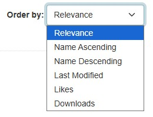
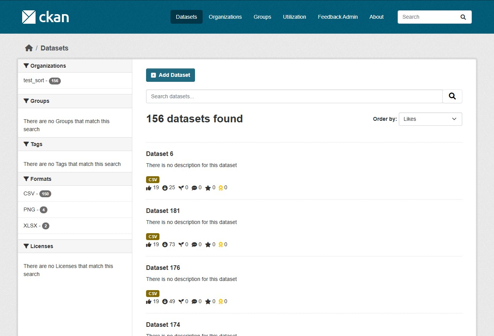
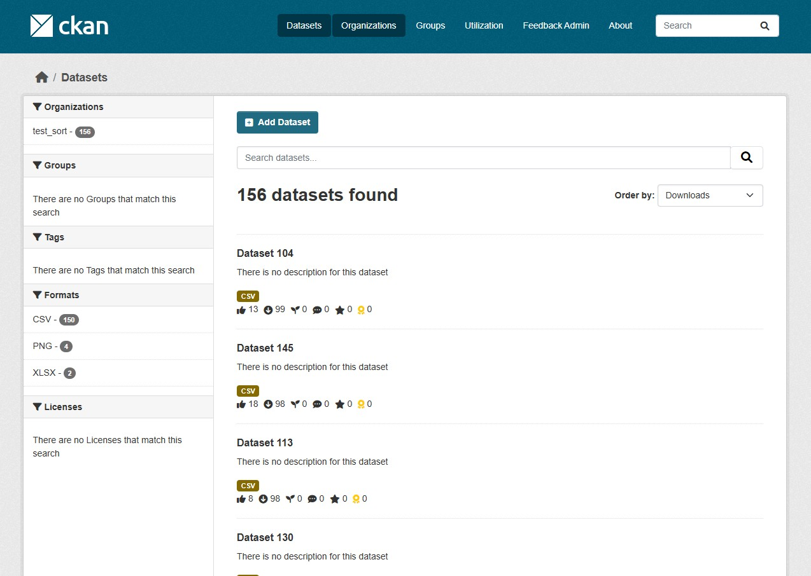

# dataset一覧画面のソートオプションの追加 

detaset一覧画面のソートオプションにいいね数とダウンロード数を追加します。



## 概要

**本機能は、feedbackプラグインのLikeとDownloadを有効にしている場合に機能します。**


## 主要機能


### いいね数でソート

いいね数の降順でデータセットをソートすることができます。




### ダウンロード数でソート

ダウンロード数の降順でデータセットをソートすることができます。




## 設定方法

### 注意点

既存のデータセットに本機能を適応させる場合、以下のコマンドを実行する必要があります。 


```bash
# 全データセットを再インデックス
ckan -c /path/to/ckan.ini search-index rebuild

# 特定のデータセットのみ再インデックス
ckan -c /path/to/ckan.ini search-index rebuild <dataset-name> 
```

再インデックスが必要なデータセットを探すには、以下のコマンドを実行してください。

```bash
# インデックスされていないデータセットの確認
ckan -c /path/to/ckan.ini search-index check
```


**上記のパス`/path/to/ckan.ini`は、ご利用の環境に合わせて適宜置き換えてください。**

[コマンド参照ページ](https://docs.ckan.org/en/latest/maintaining/cli.html#search-index-rebuild-search-index)


---


各機能のON/OFF設定については、以下のドキュメントをご参照ください：

📖 [ON/OFF機能の詳細ドキュメント](./switch_function.md)