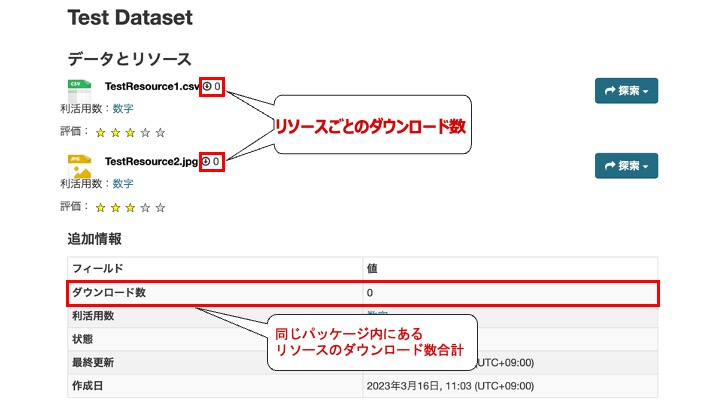

# ダウンロード機能

ダウンロード数を集計し、可視化する機能です。

## 機能説明

1. データリソースごとのダウンロード数を集計することが出来ます

2. 以下の2つの集計情報を可視化することが出来ます
    * データリソースごとのダウンロード数
    * パッケージ内のリソースごとのダウンロード数の合計

【ダウンロード機能　イメージ図】  

## 導入の利点

* データの利活用状況を知ることができる
    * データの公開や整備の計画を立てる際の指針になる
    * オープンデータの重要性をより認識することができる
