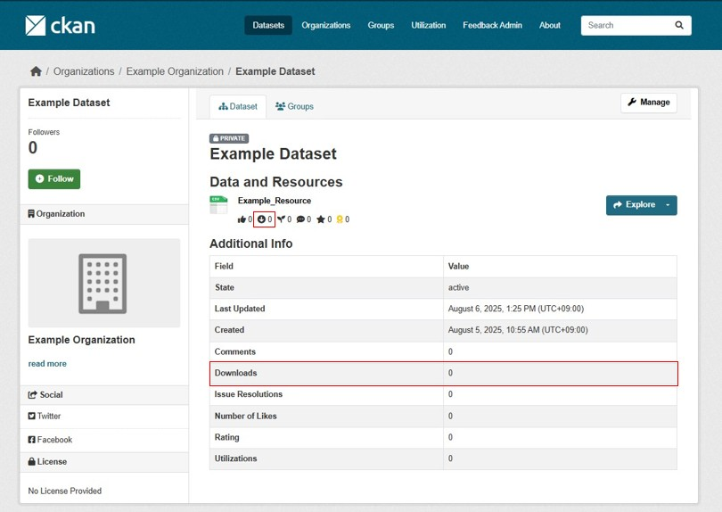
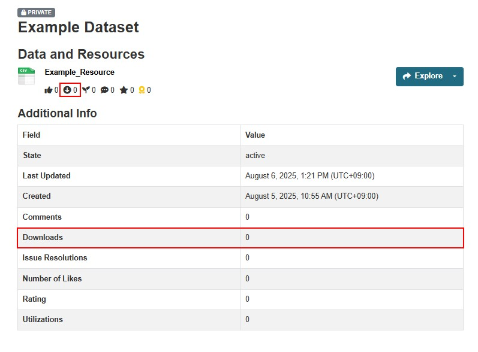
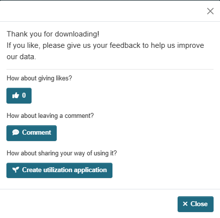
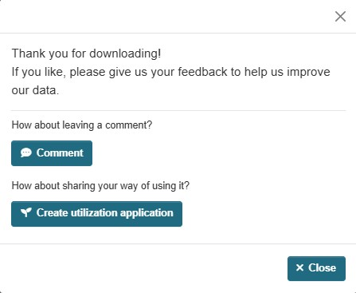

# Download モジュール

ダウンロード数を集計し、可視化するモジュールです。

## 概要

### 導入の利点

* データの利活用状況を知ることができる。
  * データの公開や整備の計画を立てる際の指針になる。
  * オープンデータの重要性をより認識することができる。

## 主要機能

* データリソースごとのダウンロード数を集計することが出来ます。

* 以下の2つの集計情報を可視化することが出来ます。
  * データリソースごとのダウンロード数
  * パッケージ内のリソースごとのダウンロード数の合計

## オプション機能

### Feedback Prompt (モーダルウィンドウ)
ダウンロードボタンを押下した際にフィードバックを求めるモーダルウィンドウが表示されます。

### 機能説明

#### 1. いいねボタン
いいねボタンの状態はダウンロード画面、モーダルウィンドウ上のいいねボタンと連動しています。

Likeモジュールの詳細機能は以下のドキュメントをご参照ください。

[Likeモジュールの詳細ドキュメント](./likes.md)

#### 2. 利活用方法登録ボタン

利活用方法登録ボタンを押下すると別タブで利活用方法登録画面に遷移します。

Utilizationモジュールの詳細機能は以下のドキュメントをご参照ください。

[Utilizationモジュールの詳細ドキュメント](./utilization.md)

#### 3. コメントボタン

コメントボタンを押下すると別タブでリソースコメント登録画面に遷移します。

Resourceモジュールの詳細機能は以下のドキュメントをご参照ください。

[Resourceモジュールの詳細ドキュメント](./resource.md)

## 設定方法
**ONにしているモジュールのみモーダルウィンドウ内でも表示されます。**

(例)：LikeモジュールのみOFFの場合、利活用方登録ボタン、コメントボタンのみ表示

設定方法は以下のドキュメントをご参照ください。  
[ON/OFF機能の詳細ドキュメント](./switch_function.md)
