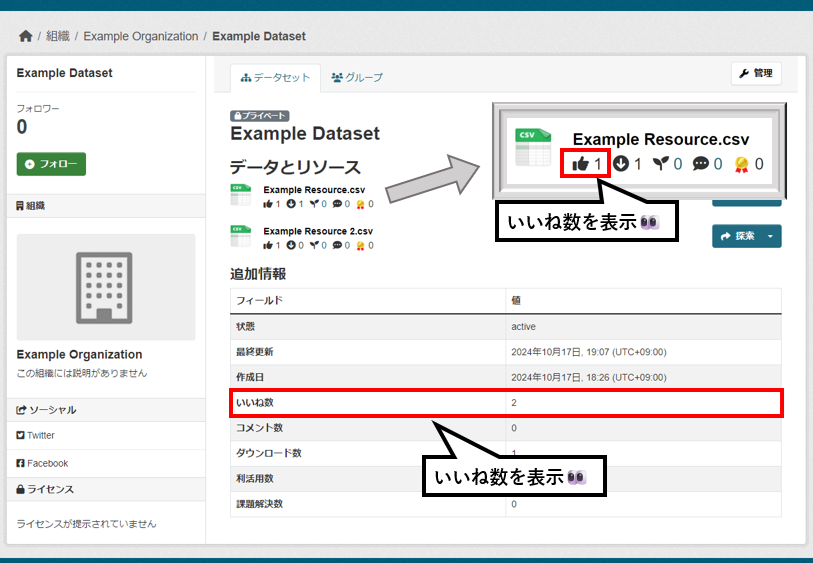

# like モジュール

いいね数を集計し、可視化するモジュールです。

## 導入の利点

* データやコンテンツへの関心度を把握できる
  * 人気のあるデータの特定や分析が可能
  * ユーザーニーズに基づいたコンテンツ改善の指針となる
  * オープンデータの利活用促進につながる

## 機能説明

【like モジュール　イメージ図】  

* データリソースごとのいいね数を集計することが出来ます

* 以下の2つの集計情報を可視化することが出来ます
  * データリソースごとのいいね数
  * パッケージ内のリソースごとのいいね数の合計
