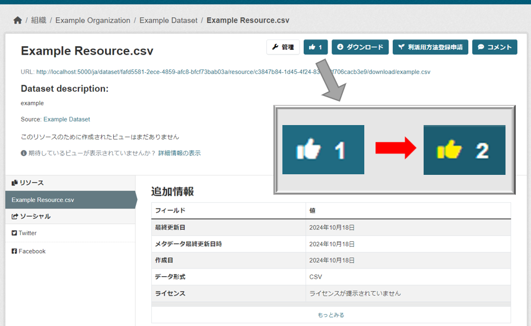
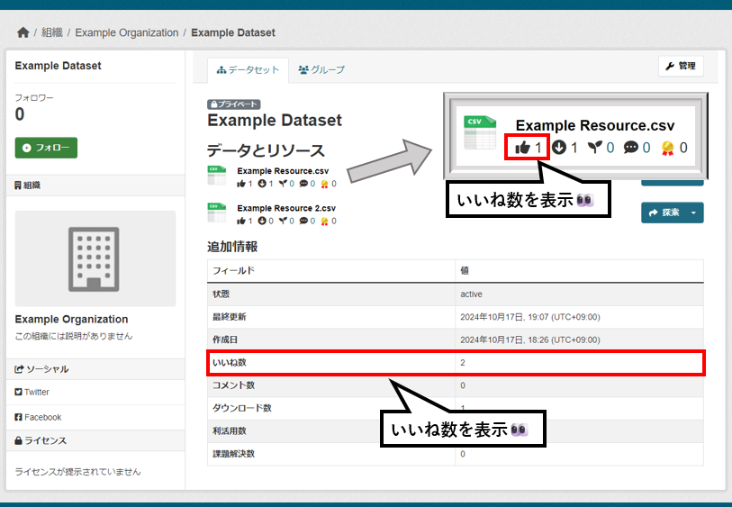

# like モジュール

登録された各データリソースに対してユーザーが「いいね！」を付けることができ、データリソースごとの「いいね数」を可視化します。

## 導入の利点

- ユーザーエンゲージメントの向上
  - ユーザーが簡単にフィードバックを提供できるため、参加意欲が高まる
  - いいね機能を通じて、人気のあるデータが自然に共有される
  
- データリソースの質の把握
  - 人気度を数値で確認できるため、有用なデータの優先改善・メンテナンスが可能
  - 人気のデータが可視化されることで、他のユーザーの関心も高まり、データ活用が促進される

## 機能説明

### ボタン操作

画面の右上にある`いいねボタン`を押すと、以下の動作が行われます。  
- アイコンの色が変わる
- いいね数が増加する

【ボタン操作　イメージ図】

### 可視化

以下の２種類のいいね数を確認できます。

| 可視化対象 | 説明 |
| :-: | :-: |
| データリソースごとのいいね数 | 各データリソースについたいいね数を表示 |
| パッケージ内の合計いいね数 | パッケージ内のすべてのデータリソースの合計いいね数を表示 |

【可視化　イメージ図】

## オプション

設定方法は以下のドキュメントをご参照ください。  
[ON/OFF機能の詳細ドキュメント](./switch_function.md)
