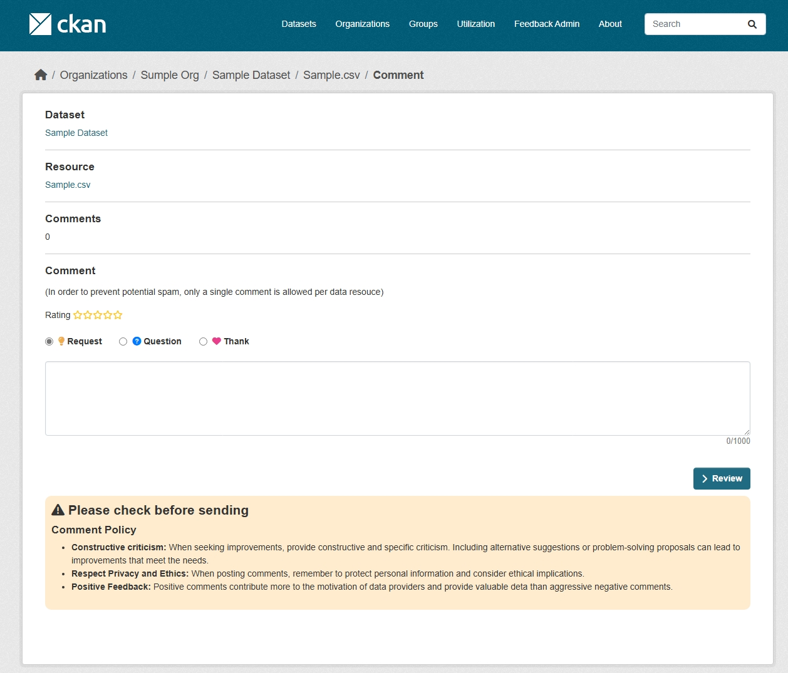
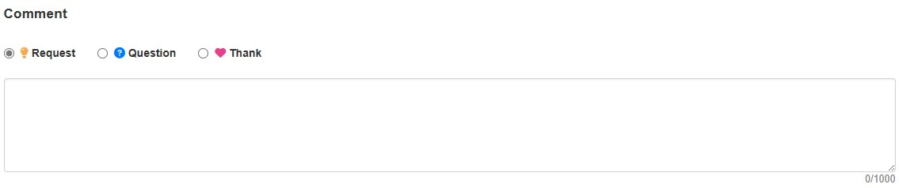
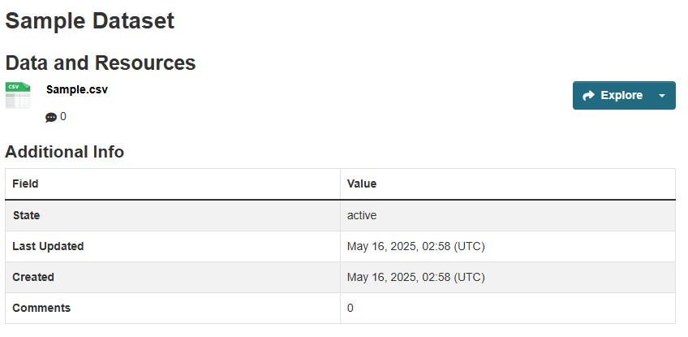
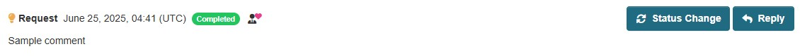
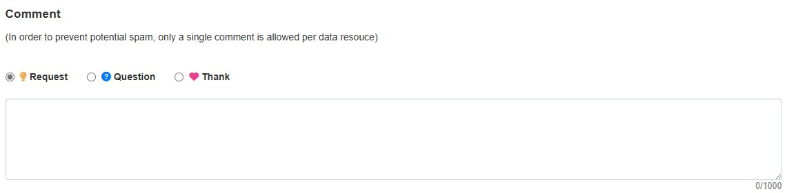
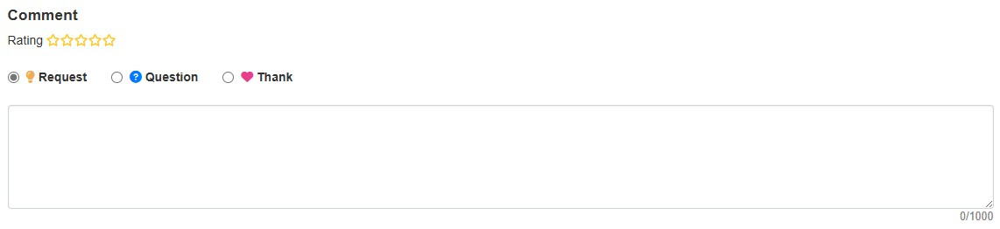

# resource モジュール

データリソースに対してコメントや評価ができるモジュールです。

## 導入の利点

* データの利活用状況を知ることができる
  * データの公開や整備の計画を立てる際の指針になる
  * オープンデータの重要性をより認識することができる

* データへの問い合わせが簡単にできる
  * データへの理解が進み、利活用が進む

## 機能説明 

* データリソースに対して以下のことが出来ます
  * データリソースごとへのコメント

  

* 以下の集計情報を可視化することが出来ます
  * データリソースへのコメント数

* 管理者による対応状況管理
  * リソースコメントに対する対応状況の管理
  * 対応状況の可視化（未対応、対応中、対応済み、見送り）
  * 管理者からの高評価機能

## オプション

**repeat post limit**

1つのリソースに対してコメントできる回数を各ユーザーごと、１回に制限することができます。(Cookie使用)  
- スパム対策に有効

**rating**

データリソースごとへの評価を星5つで表現することができます。

## 設定方法

設定方法は以下のドキュメントをご参照ください：[ON/OFF機能の詳細ドキュメント](./switch_function.md)
