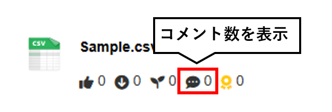
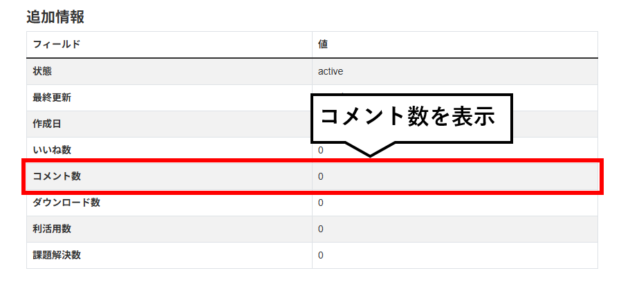
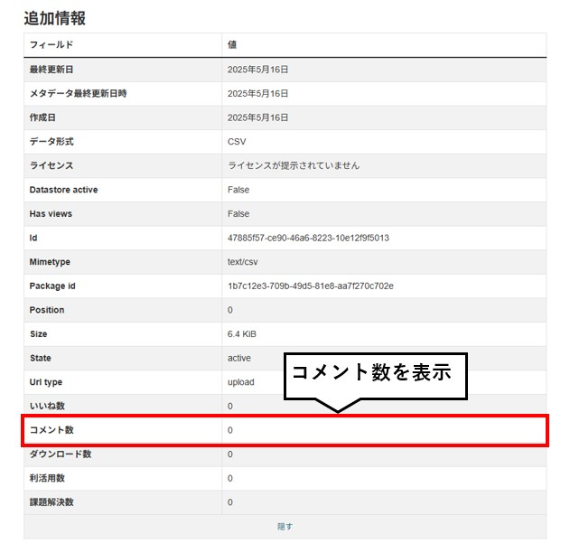
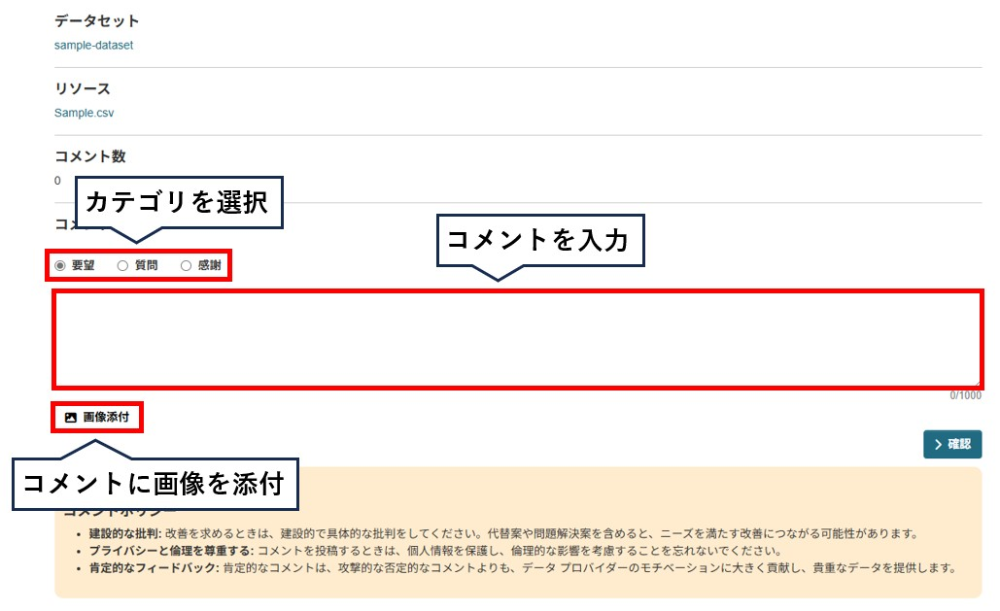
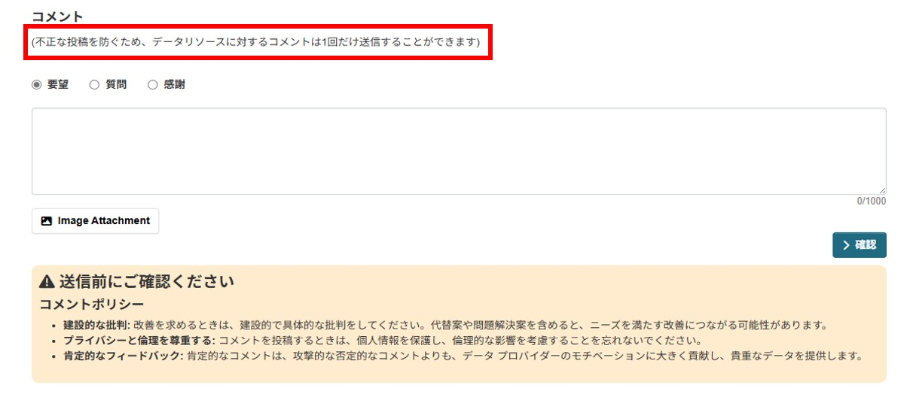
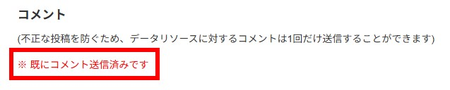
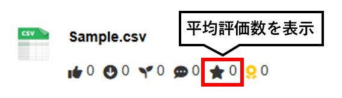
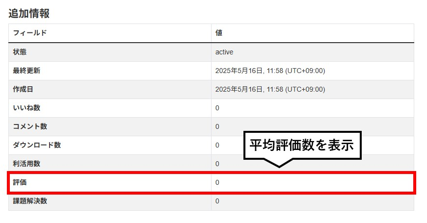
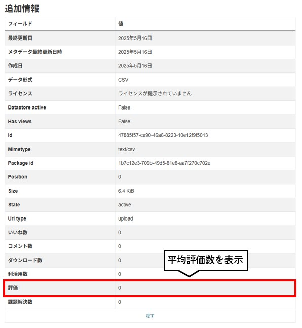
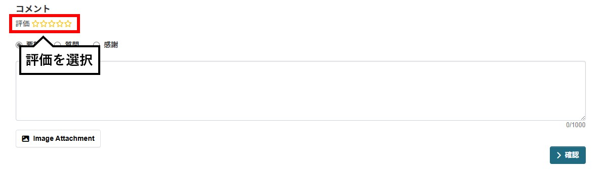

# resource モジュール

データリソースに対してコメントすることができ、コメント数を可視化するモジュールです。

## 導入の利点

* データの利活用状況を知ることができる
  * データの公開や整備の計画を立てる際の指針になる
  * オープンデータの重要性をより認識することができる

* データへの問い合わせが簡単にできる
  * データへの理解が進み、利活用が進む

## 機能説明

【リソース画面　イメージ図】  
 

【リソース詳細画面　イメージ図】

【コメント画面　イメージ図】  

 

* データリソースに対して以下のことができます
  * データリソースへのコメント（画像を添付することもできます）

* 以下の集計情報を可視化することができます
  * データセットごとのコメント数
  * データリソースごとのコメント数

## オプション

### repeat post limit 機能

【コメント画面　イメージ図】  

1つのリソースに対してコメントできる回数を各ユーザーごと、１回に制限することができます。(ユーザーのCookie情報を利用)  
※ 不正な投稿を防ぐため

### rating 機能

【リソース画面　イメージ図】  
 

【リソース詳細画面　イメージ図】

【コメント画面　イメージ図】 

データリソースごとへの評価を星5つで表現することができます。

設定方法は以下のドキュメントをご参照ください。  
[ON/OFF機能の詳細ドキュメント](./switch_function.md)
