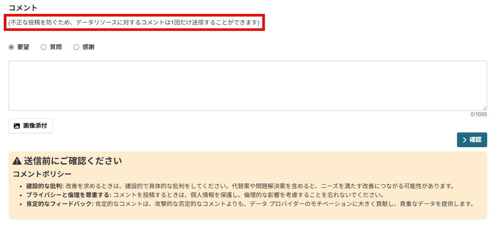
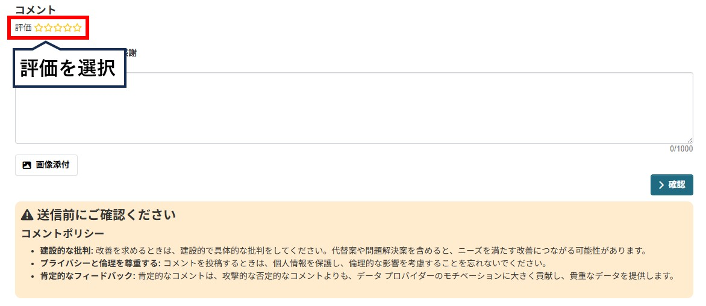

# resource モジュール

データリソースに対してコメントすることができ、コメント数を可視化するモジュールです。  

## 導入の利点

* データの利活用状況を知ることができる
  * データの公開や整備の計画を立てる際の指針になる
  * オープンデータの重要性をより認識することができる

* データへの問い合わせが簡単にできる
  * データへの理解が進み、利活用が進む

## 機能説明

【リソース画面　イメージ図】  
 


【リソース詳細画面　イメージ図】  


【コメント画面　イメージ図】  


 

* データリソースに対して以下のことができます
  * データリソースへのコメント（画像を添付することもできます）

* 以下の集計情報を可視化することができます
  * データセットごとのコメント数
  * データリソースごとのコメント数

### 画像添付に関する設定

* 画像ファイルの格納ディレクトリの指定（任意）

画像を格納するディレクトリを指定したい場合は、`ckan.ini`に以下の設定を追加してください。

```ini
ckan.feedback.storage_path = /path/to/storage
```
・ 上記のパス`/path/to/storage`は、ご利用の環境に合わせて 適宜置き換えてください。  
・ この設定が未指定の場合、`/var/lib/ckan/feedback`ディレクトリがデフォルトの保存先として使用されます。

## オプション

### repeat post limit 機能

【コメント画面　イメージ図】  



不正な投稿を防ぐため、1つのリソースに対してコメントできる回数を各ユーザーごと、１回に制限することができます。  
設定することで、専用のメッセージが表示されます。

### rating 機能

【リソース画面　イメージ図】  
 


【リソース詳細画面　イメージ図】  


【コメント画面　イメージ図】  


データリソースごとへの評価を星5つで表現することができます。

設定方法は以下のドキュメントをご参照ください。  
[ON/OFF機能の詳細ドキュメント](./switch_function.md)
