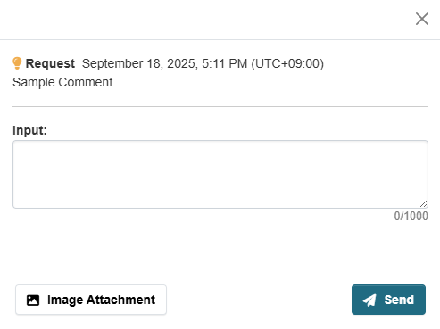

# Resource モジュール

データリソースに対してコメントや評価ができるモジュールです。


## 概要

### 導入の利点

* **データの利活用状況の把握**
  * データの公開や整備の計画を立てる際の指針になる
  * オープンデータの重要性をより認識することができる

* **データへの問い合わせの簡素化**
  * データへの理解が進み、利活用が促進される

## 主要機能

### 1. コメント機能

データリソースに対して以下のことができます：
* データリソースへのコメント投稿
* **画像添付機能**（オプション）


### 2. 集計情報の可視化

以下の情報を可視化することができます：
* データリソースへのコメント数


### 3. 管理者による対応状況管理

* リソースコメントに対する対応状況の管理
* 対応状況の可視化
  * 未対応
  * 対応中
  * 対応済み
  * 見送り
* 管理者からの高評価機能


## オプション機能

### Repeat Post Limit（投稿制限）

1つのリソースに対してコメントできる回数を各ユーザーごとに1回に制限することができます。

* **用途**: スパム対策
* **技術**: Cookie使用


### Rating（評価機能）

データリソースごとへの評価を星5つで表現することができます。


### Image Attachment（画像添付）

コメントや返信に画像を添付することを可能にします。




### Reply Open（返信機能）

管理者以外でも、コメントに対して返信することができます。


#### 設定方法

画像を格納するディレクトリを指定したい場合は、`ckan.ini`に以下の設定を追加してください：

```ini
ckan.feedback.storage_path = /path/to/storage
```

**注意事項**:
* 上記のパス`/path/to/storage`は、ご利用の環境に合わせて適宜置き換えてください
* この設定が未指定の場合、`/var/lib/ckan/feedback`ディレクトリがデフォルトの保存先として使用されます

## 設定方法

各機能のON/OFF設定については、以下のドキュメントをご参照ください：

📖 [ON/OFF機能の詳細ドキュメント](./switch_function.md)
