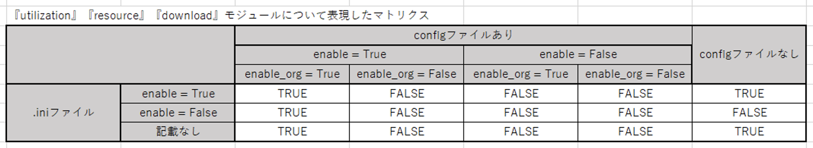
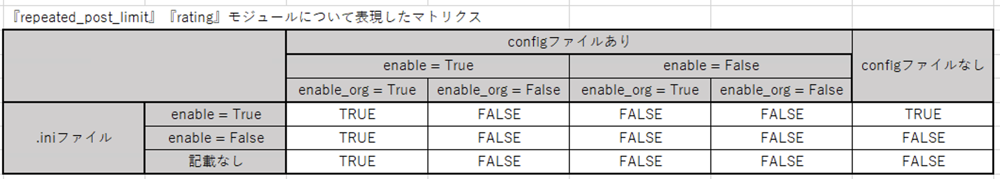

# オンオフ機能

* ckanext-feedbackには以下の3つのモジュールがあり、各モジュールのオンオフを切り替えることが出来ます。
  * [Utilization](./utilization.md) (データの利活用方法に関するモジュール)
  * [Resource](./resource.md) (リソースへのコメントに関するモジュール)
  * [Download](./download.md) (ダウンロードに関するモジュール)

※ デフォルトでは全てのモジュールがオン(`True`)になっています

* [Resource](./resource.md)についてはさらに以下のオプションのオンオフを切り替えることが出来ます。
  * 1つのリソースに対してコメントできる回数を各ユーザーごと、1回に制限する機能
  * リソースへの評価を行う機能

※ デフォルトでは上記2つのオプションはオフ(`False`)になっています

## 設定方法

* 各モジュールとオプションを設定するには、以下の２通りの方法があります。
  * `ckan.ini`にオンオフの設定を記述する。
    * Organizationごとにモジュールのオンオフ設定はできない
  * `feedback_config.json`に設定を記述し、CKAN環境に配置する。
    * Organizationごとにモジュールのオンオフ設定が可能

`ckan.ini`と`feedback_config.json`の2つの設定を行った場合、  
`feedback_config.json`に記述した設定が`ckan.ini`に記述した設定よりも優先されます。  

(例)  
`ckan.ini`にUtilizationの`enable`を`false`として記載  
`feedback_config.json`にUtilizationの`enable`を`true`として記載し、`enable_org`にorganization1の`name`を記述  
→ `feedback_config.json`の設定が優先され、organization1にて、Utilizationがオンになる  

詳細は以下のマトリクスを参照して下さい。  

* 縦軸：`ckan.ini`への設定記述の有無と記述された設定(`enable`)を表現しています。
* 横軸：`feedback_config.json`の有無と記述された設定(`enable`, `enable_org`)を表現しています。
  * `enable`は`True`/`False`の値を設定可能です
  * `enable_org`はリスト型の配列で、Organizationの`name`を格納することで、格納されたOrganizationは設定をオンにできます。
    * 設定方法の詳細は設定手順をご覧ください。

モジュールのオンオフ設定 優先度マトリクス  


オプションのオンオフ設定 優先度マトリクス  


## 設定手順

`ckanext-feedback`のインストール(まだの方のみ)

* [クイックスタート](../../README.md) **1~4番**の手順を参照してください

### `ckan.ini`でオンオフの設定を行う場合

※ この方法で設定を行った場合はすべてのOrganizationにおいて、モジュールがオンまたは、オフになる  
※ `feedback_config.json`に設定が記述され、CKAN環境に配置されている場合は本設定は反映されません

1. **オフにするモジュール**について、`ckan.plugins`の下に以下の記述を追記する
    * utilizationモジュールをオフにする場合

        ```bash
        ckan.feedback.utilizations.enable = False
        ```

    * resourceモジュールをオフにする場合

        ```bash
        ckan.feedback.resources.enable = False
        ```

        * 1つのリソースに対してコメントできる回数を各ユーザーごと、１回に制限する場合(ユーザーのCookieを利用)
            * デフォルトの設定(False)では複数回のコメントが可能です

            ```bash
            ckan.feedback.resources.comment.repeated_post_limit.enable = True
            ```

        * リソースへの評価を行う機能をオンにする場合
          * デフォルトの設定(False)では、星5つでの評価機能を利用することはできません

            ```bash
            ckan.feedback.resources.comment.rating.enable = True
            ```

    * downloadモジュールをオフにする場合

        ```bash
        ckan.feedback.downloads.enable = False
        ```

2. テーブル作成(まだの方のみ)
    * [feedbackコマンド](./feedback_command.md)の```-modules```オプションを参考に**オンにするモジュール**のテーブル作成を行なってください

### `feedback_config.json`でオンオフの設定を行う場合

1. `ckanext-feedback/feedback_config_sample.json`の編集を行います
    * (例1) Utilizationをオフにする場合

    ```json
    {
        "modules": {
            "utilizations": {
                "enable": false,
                "enable_orgs": []
            },
        }
    }
    ```

    * (例2) 以下の3つの設定を行う場合
      * organization1とorganization2において、Resourceをオンにする
      * また、1つのリソースに対する複数回のコメント制限するオプションはオフにする
      * organization1のみリソースへの評価機能をオンにする
        * `{organization1のname}`, `{organization2のname}`にはそれぞれのOrganizationの`name`を記述してください

    ```json
    {   
        "modules": {
            "resources": {
                "enable": true,
                "enable_orgs": ["{organizaiton1のname}", "{organizaiton2のname}"],
                "comments": {
                    "repeat_post_limit": {
                        "enable": false,
                        "enable_orgs": []
                    },
                    "rating": {
                        "enable": true,
                        "enable_orgs": ["{organizaiton1のname}"]
                    }
                }
            }
        }
    }
    ```

    ※ `name`が記述されていないOrganizationは、モジュールやオプションはオフとなる

2. `feedback_config.json`をCKAN環境に配置する
    * `/srv/app`配下に`feedback_config.json`を配置する
      * `/srv/app`以外の場所に配置する場合は以下の設定を`ckan.ini`に記述する
        * `{feedback_config.jsonを格納しているディレクトリパス}`にパスを記述してください (例) `/etc/ckan/default`

      ```bash
      ckan.feedback.config_file = {feedback_config.jsonを格納しているディレクトリパス}
      ```

3. テーブル作成(まだの方のみ)
    * [feedbackコマンド](./feedback_command.md)の```-modules```オプションを参考に**オンにするモジュール**のテーブル作成を行なってください

## downloadモジュールを外部プラグインと連携する場合

リソースがダウンロードされると、downloadモジュールはダウンロード数のカウント処理を行った後、デフォルトのダウンロードコールバックである`ckan.views.resource:download`を呼び出します。</br>
しかし、そのコールバックを他Extensionの関数（例：[googleanalytics](https://github.com/ckan/ckanext-googleanalytics) のdonwload関数）に変更したい場合があります。</br>
その場合ckan.ini内の設定変数ckan.feedback.download_handlerへ対象の関数を指定することで置き換えることも可能です。

例：ckanext-googleanalytics の場合

```bash
ckan.feedback.download_handler = ckanext.googleanalytics.views:download
```

また、逆に外部ハンドラを設定できる他のExtensionのコールバックとしてckanext-feedbackのdownloadモジュールを指定したい場合は、`ckanext.feedback.views.download:download`を使用できます。

例：ckanext-googleanalytics の場合

```bash
googleanalytics.download_handler = ckanext.feedback.views.download:download
```

これらの連携方法は、複数のextensionを使用する際に`/download`などのパスが競合してしまう場合に役立ちます。
