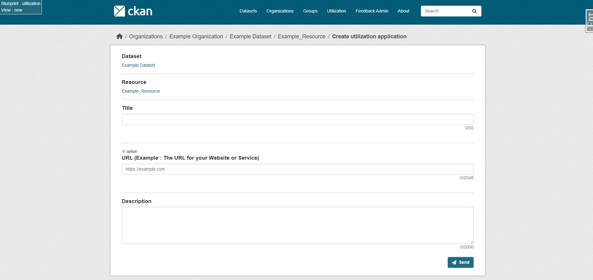
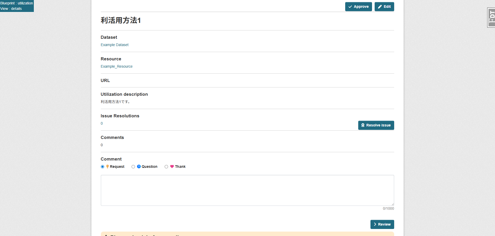
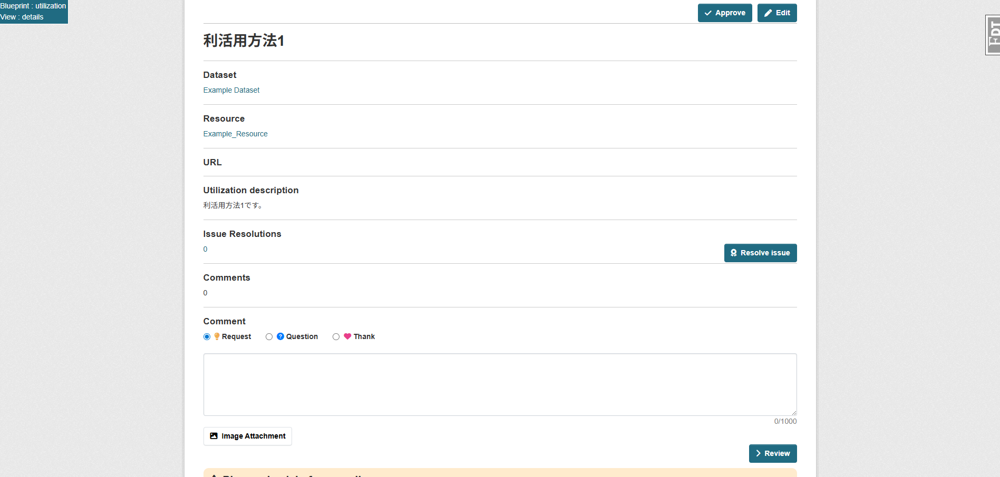

# utilization モジュール

データに紐づけて利活用方法を登録することができるモジュールです。  
登録した利活用方法へコメントを送ることも出来ます。
## 概要

## 導入の利点

* **データの利活用状況を知ることができる**
  * データの公開や整備の計画を立てる際の指針になる
  * オープンデータの重要性をより認識することができる

* データを使った利活用方法の利用と改善が進む
  
* 以下の3つの集計情報を可視化することが出来ます
  * データリソースごとの利活用数
  * 利活用の課題解決数
  * 利活用方法へのコメント数

## 主要機能
  ### 1. 利活用方法の登録
  データリソースに対して以下のことが出来ます：
 * データリソースに対しての利活用方法登録
   
 

  ### 2. 利活用方法の検索
  
   
  
  ### 3. 利活用方法へのコメント
  
 

 ## オプション機能

 ### Image Attachment（画像添付）

コメントに画像を添付することを可能にします。

  

#### 設定方法

各機能のON/OFF設定については、以下のドキュメントをご参照ください：

📖 [ON/OFF機能の詳細ドキュメント](./switch_function.md)
